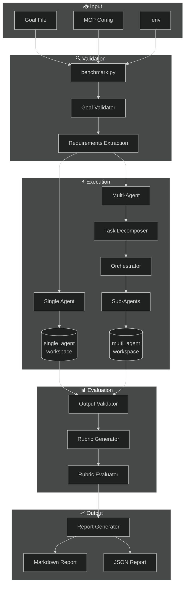
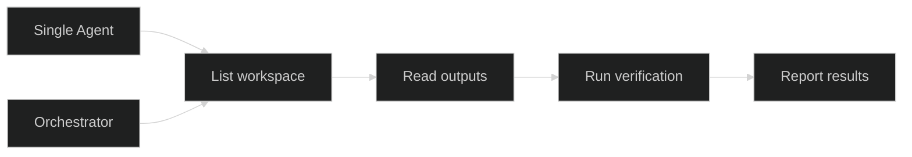
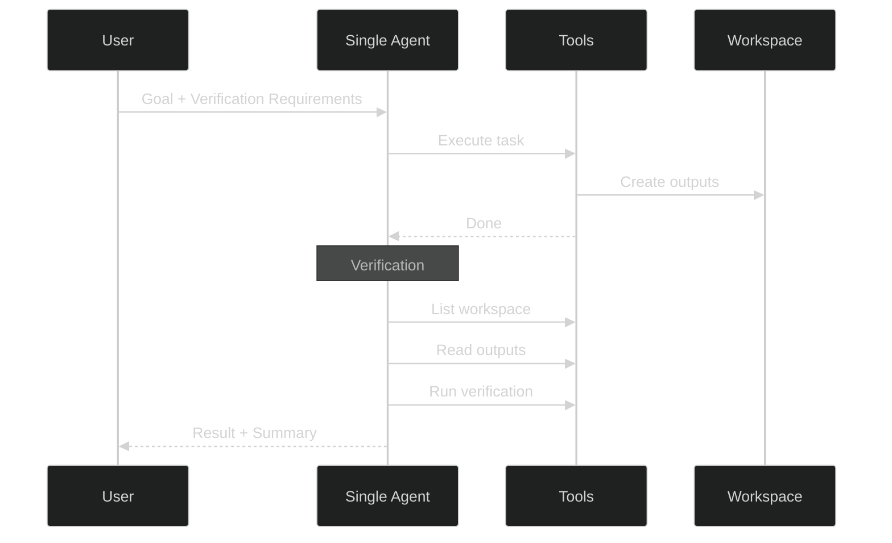
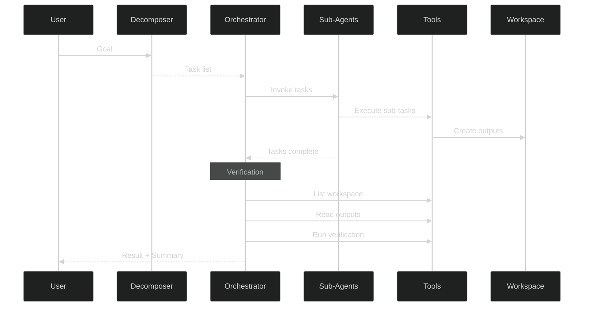
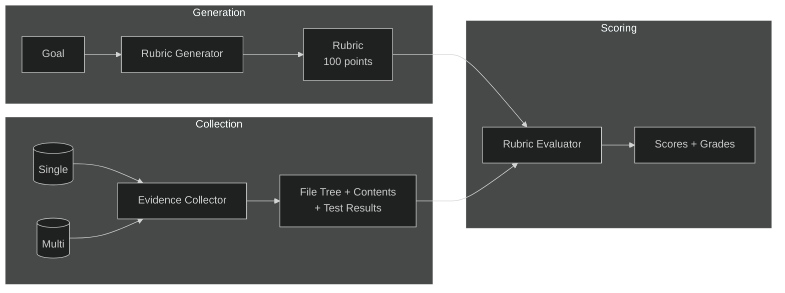

# Agent Benchmark System

A benchmarking system to compare single-agent vs multi-agent approaches for completing goals using the Strands Agents framework.

## Overview

This system runs the same goal through two different agent architectures and compares their performance:

- **Single Agent**: One agent with full context, using summarization for long conversations
- **Multi-Agent**: An orchestrator that decomposes the goal and delegates to specialized sub-agents

Both approaches are given identical verification requirements to ensure an apples-to-apples comparison.

## Workflow



## Apples-to-Apples Comparison

To ensure fair comparison, both agent types must perform equivalent work:



### How It Works

1. **Requirements Extraction**: The goal is parsed to identify expected output files
2. **Verification Instructions**: Both agents receive mandatory verification steps in their prompts
3. **Enforced Verification**: Agents must verify their work before completing
4. **Post-Validation**: The benchmark independently validates outputs to confirm compliance
5. **Fair Metrics**: Token usage reflects equivalent work performed by both approaches

## Single Agent Approach



1. Creates one agent with all available tools
2. Uses `SummarizingConversationManager` to handle context overflow
3. Summarization triggers at 80% of model's context window
4. Must complete verification steps before finishing
5. Tracks all token usage and tool calls

## Multi-Agent Approach



1. **Task Decomposition**: Uses Claude to break down the goal into sub-tasks
   - Separates by concern and tool requirements
   - Identifies dependencies between tasks
   - Documents rationale for separation

2. **Orchestration**: A coordinator agent manages sub-agents
   - Executes tasks in dependency order
   - Passes context between dependent tasks
   - Performs verification after all tasks complete
   - Aggregates results

3. **Sub-Agents**: Specialized agents for each task
   - Focused prompts for specific responsibilities
   - Independent token tracking
   - Isolated execution

## Rubric-Based Evaluation



The evaluation system:

- **Rubric Generator**: Creates a 100-point rubric with categories and criteria from the goal
- **Evidence Collector**: Gathers file trees, contents, test results, and keyword matches
- **Rubric Evaluator**: LLM-based scoring with detailed reasoning per criterion

## Installation

```bash
cd agent_benchmark
python -m venv .venv
source .venv/bin/activate  # or .venv\Scripts\activate on Windows
pip install -r requirements.txt
```

## Configuration

Create a `.env` file with your Anthropic API key:

```
ANTHROPIC_API_KEY=your_api_key_here
```

### Environment Variables

| Variable                    | Description                       |
| --------------------------- | --------------------------------- |
| `ANTHROPIC_API_KEY`         | Required. Your Anthropic API key  |
| `BENCHMARK_MODEL`           | Model ID to use                   |
| `BENCHMARK_MCP_CONFIG`      | Path to MCP config file           |
| `BENCHMARK_OUTPUT`          | Output directory                  |
| `BENCHMARK_TEMPERATURE`     | Model temperature                 |
| `BENCHMARK_TOP_P`           | Top-p sampling                    |
| `BENCHMARK_TOP_K`           | Top-k sampling                    |
| `BENCHMARK_MAX_TOKENS`      | Max output tokens                 |
| `BENCHMARK_SKIP_VALIDATION` | Skip goal validation (true/false) |
| `BENCHMARK_QUIET`           | Disable spinners (true/false)     |
| `BENCHMARK_YES`             | Auto-confirm (true/false)         |

CLI arguments override environment variables.

### MCP Configuration

Configure MCP tools in `mcp.json`:

```json
{
  "mcpServers": {
    "filesystem": {
      "command": "npx",
      "args": ["-y", "@modelcontextprotocol/server-filesystem", "./workspace"]
    }
  }
}
```

## Agent Tools

### Filesystem Tools (MCP)

The MCP filesystem server provides sandboxed file operations:

- `read_file` - Read file contents
- `write_file` - Create or overwrite files
- `list_directory` - List directory contents
- `create_directory` - Create directories
- `move_file` - Move/rename files
- `search_files` - Search for files by pattern
- `get_file_info` - Get file metadata

### Code Execution (Sandbox)

The `execute_command` tool allows agents to run shell commands within the workspace:

```python
execute_command(command="python -m pytest test_calculator.py -v")
execute_command(command="python calculator.py")
execute_command(command="ls -la")
```

Commands are executed with a 60-second timeout and are restricted to the workspace directory.

## Usage

### Basic Usage

```bash
python benchmark.py --goal goal.md
```

### Full Options

```bash
python benchmark.py \
  --goal goal.md \
  --mcp-config mcp.json \
  --output ./results \
  --model claude-sonnet-4-6 \
  --temperature 0.7 \
  --max-tokens 8192 \
  --skip-validation \
  --quiet \
  --yes
```

### CLI Arguments

| Argument            | Short | Description                              | Default        |
| ------------------- | ----- | ---------------------------------------- | -------------- |
| `--goal`            | `-g`  | Path to goal markdown file               | Required       |
| `--mcp-config`      | `-m`  | Path to MCP config file                  | `mcp.json`     |
| `--output`          | `-o`  | Output directory                         | Auto-generated |
| `--model`           |       | Model ID to use                          | Interactive    |
| `--skip-validation` |       | Skip goal validation step                | False          |
| `--temperature`     |       | Model temperature (0.0-1.0)              | 1.0            |
| `--top-p`           |       | Top-p sampling (nucleus sampling)        | None           |
| `--top-k`           |       | Top-k sampling                           | None           |
| `--max-tokens`      |       | Max output tokens                        | Model default  |
| `--quiet`           | `-q`  | Disable spinner/progress indicators      | False          |
| `--yes`             | `-y`  | Auto-confirm prompts (skip confirmation) | False          |

## Output Structure

```
benchmark_results_YYYYMMDD_HHMMSS/
├── goal.md                    # Copy of the input goal
├── rubric.json                # Generated assessment rubric
├── benchmark_report.md        # Human-readable report
├── benchmark_report.json      # Machine-readable report
├── single_agent/
│   ├── master_prompt.md       # System prompt used
│   ├── metrics.json           # Token and timing metrics
│   ├── messages.json          # Full conversation history
│   ├── tool_calls.json        # Tool call history
│   └── result.json            # Execution result
├── multi_agent/
│   ├── master_prompt.md       # Orchestrator prompt
│   ├── task_decomposition.json # How goal was broken down
│   ├── aggregate_metrics.json  # Combined metrics
│   ├── orchestrator/
│   │   ├── metrics.json
│   │   ├── messages.json
│   │   └── tool_calls.json
│   └── sub_agent_task_N/
│       ├── prompt.md
│       ├── metrics.json
│       ├── messages.json
│       └── result.json
└── workspace/
    ├── single_agent/          # Files created by single agent
    └── multi_agent/           # Files created by multi-agent
```

## Benchmark Report

The generated report includes:

- **Executive Summary**: Quick comparison table with validation status
- **Output Validation**: File existence, syntax checks, test results
- **Rubric Evaluation**: Quality scores, grades, strengths, weaknesses
- **Token Usage**: Detailed breakdown by category with costs
- **Error Metrics**: Error rates, retries, time spent on retries
- **Execution Metrics**: Timing and tool call counts
- **Task Decomposition Analysis**: How the goal was broken down
- **Post-Mortem Analysis**: Output comparisons beyond rubric scoring
- **Conclusions**: When to use each approach

### Sample Report Output

```
| Metric           | Single Agent | Multi-Agent | Winner    |
|------------------|--------------|-------------|-----------|
| Total Tokens     | 29,860       | 159,374     | 🏆 Single |
| Execution Time   | 40.07s       | 240.70s     | 🏆 Single |
| Total Cost       | $0.34        | $3.13       | 🏆 Single |
| Quality Score    | 100/100 (A)  | 100/100 (A) | Tie       |

✅ Apples-to-apples comparison: Both outputs validated successfully
```

## Supported Models

| Model                      | Context Window | Max Output | Input Cost | Output Cost |
| -------------------------- | -------------- | ---------- | ---------- | ----------- |
| claude-sonnet-4-6          | 1,000,000      | 128,000    | $3.00/1M   | $15.00/1M   |
| claude-opus-4-6            | 1,000,000      | 128,000    | $15.00/1M  | $75.00/1M   |
| claude-opus-4-5-20251101   | 200,000        | 64,000     | $15.00/1M  | $75.00/1M   |
| claude-sonnet-4-5-20250929 | 1,000,000      | 64,000     | $3.00/1M   | $15.00/1M   |
| claude-haiku-4-5-20251001  | 200,000        | 64,000     | $0.80/1M   | $4.00/1M    |
| claude-opus-4-20250514     | 200,000        | 32,000     | $15.00/1M  | $75.00/1M   |
| claude-sonnet-4-20250514   | 1,000,000      | 64,000     | $3.00/1M   | $15.00/1M   |

## Example

```bash
# Run with the example goal (interactive mode)
python benchmark.py --goal examples/goals/simple_goal.md

# Run non-interactively for CI/automation
python benchmark.py --goal examples/goals/simple_goal.md --model claude-sonnet-4-6 --skip-validation --quiet --yes
```

## License

MIT
